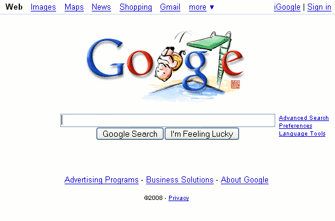
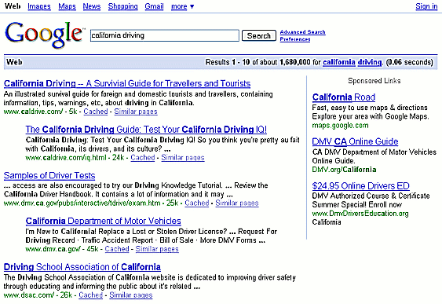

## 输入查询

如果您对谷歌没有或很少经验，请继续阅读。否则，[直接跳到第一个结果](02_Going Directly to the First Result.md)。

如果您的浏览器没有指向谷歌，请通过在浏览器中输入以下任一网址来访问谷歌主页：

- https://www.google.com/（Google的完整网址）
- www.google.com（Google网址的常见缩写）
- www.google.com（Google网址的常见缩写）
- google（适用于某些浏览器，方便最懒的打字者）

在本教程中，当我们提到网址时，省略了“https://”前缀。有关网址的描述，请参见[“Anatomy of a Web Address”](https://www.googleguide.com/web_address.html)。

您可能还有一个Google的书签或收藏夹条目，或者在浏览器窗口上有一个Google按钮。无论您如何操作，都应该能看到Google主页。

谷歌首页将在中间有一个搜索框，在顶部有一些菜单，可能还会有其他功能。有时候，谷歌会更改搜索框上方的图片。这里的图片是2008年北京奥运会期间谷歌名称（称为Google Doodle）的巧妙玩味之一：

什么是查询？它是向搜索引擎请求信息的一种方式。一个查询由一个或多个单词、数字或短语组成，你希望在搜索结果列表中找到这些内容。在Google指南中，我有时将查询称为搜索项。

要输入查询，请在Google的搜索框中键入描述性词语。您可以使用Google主页上的搜索框（如上图所示），也可以使用始终显示在Google结果页面顶部的搜索框（如下一屏幕截图所示）。现在，您还可以使用我们提供的搜索框。为了练习，请将鼠标指向此框，单击它，并键入单词[加利福尼亚州驾驶]：

现在按下回车键或点击Google搜索按钮以查看您的搜索结果。一个新窗口将打开，显示关于“加利福尼亚”和“驾驶”的搜索结果页面。结果包括与您的查询匹配的页面链接，以及相关片段（摘录），其中包含用粗体标出的搜索词。

当你完成了搜索结果后，请关闭那个窗口。这个教程窗口，带有原始的搜索框，应该还在这里。随意更改搜索框中的内容并运行其他搜索。

结果页面充满了信息和链接，其中大部分与您的查询相关。谷歌认为最相关于您查询的结果会首先显示。在谷歌搜索结果右侧出现赞助链接，这些是付费广告。

每个搜索结果的第一行是页面标题。标题会被下划线标出，即它是指向网页的链接。您可以点击标题查看该页面。（页面的URL显示在一行开头绿色字体附近，在搜索结果末尾附近）。在标题下方通常有摘录，称为片段。片段中包含一个或多个查询词以粗体显示。在我们的例子中，您可以单击链接《加州驾驶——生存指南》来查看相应的《加州驾驶指南》网页。

您在搜索“california driving”时得到的结果可能与此屏幕截图不同，因为谷歌会不断地搜索新页面并调整其结果算法。

> 标签（关键词）：查询，搜索框