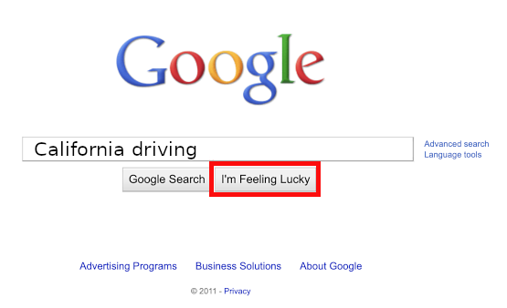
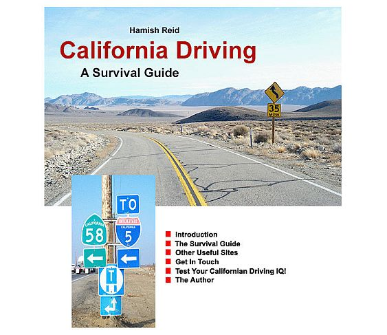

## 直接跳转到第一个结果

点击Google主页上的“手气不错”按钮，直接跳转到您查询的第一个结果。谷歌会立即将您发送到可能与您的查询最相关的结果，而不是显示页面列表。例如，如果您输入查询[加州驾驶]（不带方括号），然后点击“手气不错”按钮，则谷歌可能会将您发送到Hamish Reid精彩的《加州驾驶指南》主页。（如果在阅读本教程时Google的第一个结果已更改，则可能会看到另一页。）

要运行下面的搜索，请单击图像。一个新窗口或选项卡将打开Google的主页。在输入查询并单击“我感觉很幸运”按钮之后，关闭窗口或选项卡，您将返回此处。

在你点击了上方的“手气不错”按钮后，你可能会看到像下面这个页面一样的结果。（如果另一个页面现在是排名第一的结果，那么你就会看到那个页面。）

我手气很好”按钮可以节省您查看搜索结果并点击第一个结果所需的时间。当您确信所需页面是查询的最佳匹配时，请使用此功能，通常在寻找非常流行的页面时会这样做。例如，“我手气很好”搜索“Paul McCartney”（披头士乐队成员之一）将带您前往他的主页www.paulmccartney.com，这是一个安全的选择。

注意：“我手气很好”按钮在决定将您带到哪里时，不考虑第一个结果页面上的各种赞助链接，这些链接是付费广告。换句话说，“我手气很好”按钮会将您发送到谷歌认为最相关的非付费广告结果。

接下来，在选择搜索词方面，我们将看一下如何选择搜索词。

### 练习

这些问题让你练习输入查询。有关一些问题的提示和答案，请参阅解决方案页面。

- 通过访问www.google.com将您的浏览器指向Google主页。通过在Google搜索框中键入[google教程]（不带方括号），然后单击“Google搜索”按钮来查找Google教程。点击Google Guide链接。
- 完成前一个练习后，单击浏览器上的返回按钮两次以返回到Google主页，然后再次搜索[google教程]（不带方括号）。 单击“I'm Feeling Lucky”按钮。
- 前两个练习的结果有什么不同？
- 通过访问www.boogle.com将您的浏览器指向Boogle的主页。除了提供与Google相同的搜索功能外，Boogle还包括一个有趣的引用语。
- 通过在Boogle的搜索框中输入[巧克力舒芙蕾食谱]（不带方括号），然后单击“Google搜索”按钮，查找巧克力舒芙蕾的食谱。
- 完成前面的练习后，返回Boogle主页。（如果您仍然打开同一个窗口，请使用其后退按钮返回。否则，单击www.boogle.com。）然后再次搜索[巧克力舒芙蕾食谱]（不带方括号）。点击“I'm Feeling Lucky”按钮。

