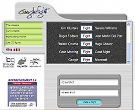
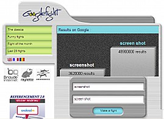

## 选择搜索词

您输入的搜索词和顺序会影响您的搜索结果中出现的页面和顺序。在下面的示例中，单击类似方式以指定各种搜索，并注意结果如何不同。

为了简单起见，本教程使用方括号来表示谷歌的搜索框。例如，要在米科诺斯岛上寻找廉价酒店，我会把“cheap”、“hotel”和“Mykonos”这三个词放在方括号中[ cheap hotel Mykonos ]，以指示您应该在谷歌的搜索框中输入这三个词。您不应该输入方括号，尽管如果您确实输入它们，谷歌将忽略它们。

此外，在接下来的示例中，每组搜索词都与这些词的谷歌搜索结果链接在一起。因此，点击[廉价米科诺斯酒店]会返回一个关于这三个单词的谷歌搜索结果页面。

### 使用可能的词语

使用可能出现在您想要的页面上的词语。

- [ [salary negotiation tips](https://www.google.com/search?q=salary+negotiation+tips) ]
- [ [sciatica](https://www.google.com/search?q=sciatica) ]
- [ [window treatments](https://www.google.com/search?q=window+treatments) ]

避免使用问题作为查询。例如，查询 [ [Does Australia have Target](https://www.google.com/search?q=Does+Australia+have+Target) ]会指示Google查找包含所有术语的页面。这样的查询不一定能找到回答您问题的页面。更好的查询可能是[ [Australia Target store](https://www.google.com/search?q=Australia+Target+store) ]。

- 使用 [ [Australia Target store](https://www.google.com/search?q=Australia+Target+store) ]
- 不用 [ [Does Australia have Target](https://www.google.com/search?q=Does+Australia+have+Target) ]

当Google检测到非常常见的单词，例如where、do、I、for和a等[停用词](https://www.googleguide.com/interpreting_queries.html#stop)时，它会忽略它们，以便返回相关结果。如果您正在寻找包含停用词的页面（例如“how the west was won”），请学习如何强制Google搜索完整短语或特定单词，在Crafting Your Query和以下页面中了解更多信息。

避免使用与您的主题相关但不希望在指定页面上找到的词语。例如，包含“关于文章”，“讨论”，“文档”和“关于页面”的查询可能会返回较少的结果，因为网络上的信息很少用这些术语标记。

- USE [ [lasik eye surgery](https://www.google.com/search?q=lasik+eye+surgery) ]
- NOT [ [documentation on lasik eye surgery](https://www.google.com/search?q=documentation+on+lasik+eye+surgery) ]

- USE [ [jobs product marketing Sunnyvale](https://www.google.com/search?q=jobs+product+marketing+Sunnyvale) ]
- NOT [ [listings of product marketing jobs in Sunnyvale](https://www.google.com/search?q=listings+of+product+marketing+jobs+in+Sunnyvale) ]

假设你想知道某个人的年龄，比如南非前总统纳尔逊·曼德拉。包含“生日”或“年龄”的页面可能已经超过一年了。搜索包含“纳尔逊·曼德拉”和“出生”的页面可能会包括“纳尔逊·曼德拉出生”或“纳尔逊·曼德拉于...出生”，后面跟着他的出生日期。通过知道他的出生日期可以计算得到他的年龄（要进行计算，请尝试使用谷歌计算器）。

- USE [ [Nelson Mandela born](https://www.google.com/search?q=Nelson+Mandela+born) ]
- NOT [ [Nelson Mandela birthday](https://www.google.com/search?q=Nelson+Mandela+birthday) ] nor [ [Nelson Mandela age](https://www.google.com/search?q=Nelson+Mandela+age) ]

不确定哪些单词或短语可能出现在您想要的页面上？考虑使用Google Fight进行单词或短语流行度比赛，您可以在www.googlefight.com找到它。这个第三方应用程序会报告两个术语或短语中哪一个Google估计在网络上更为普遍（实际上是在Google索引中包含更多网页）。

 

 

Google Fight发现“screen shot”的使用次数为48,900,000，而“screenshot”的使用次数仅为3,620,000。（在2004年，使用Google Smackdown的早期版本，“screenshot”比“screen shot”更受欢迎。）

注意：《Google运作方式》描述了Google如何找到网页并构建索引。

### 具体点

> 具体化：使用更多的查询词来缩小您的结果。

在涵盖你感兴趣的方面时，最好使用更精确、不那么模糊的术语来“丰富话题”，如Ned Fielden在他的书《互联网研究》第二版（麦克法兰公司，2001年）中所指出。

你的查询是否包含足够具体的信息，让谷歌能够明确确定你正在寻找什么？如果你的查询过于模糊，那么它很可能无法返回相关结果。例如，请考虑查询 [java]。你认为谷歌在第一页结果中包括了什么？印度尼西亚的一个岛屿吗？一种由咖啡豆研磨而成的饮料吗？还是Sun Microsystems开发的面向计算机网络、平台无关性编程语言？

- USE [ [Java Indonesia](https://www.google.com/search?q=Java+Indonesia) ], [ [java coffee](https://www.google.com/search?q=java+coffee) ], or [ [java programming language](https://www.google.com/search?q=java+programming+language) ]
- NOT [ [java](https://www.google.com/search?q=java) ]

你如何提出更具体的搜索词？你对这个主题了解多少？考虑回答以下问题：“谁？”、“什么？”、“在哪里？”、“何时？”、“为什么？”和“怎样？

当你搜索 [Tom Watson] 时，第一页的结果可能会出现议员、高尔夫球手、IBM 执行官和1900年和1904年总统候选人的普及党派成员的参考资料。如果你正在搜索可能返回许多不同类型结果的内容，应该添加一个可以区分它们之间差异的术语。这样，你就只能得到关于你感兴趣的特定 Tom Watson 的结果。

- USE [ [Tom Watson MP](https://www.google.com/search?q=Tom+Watson+MP) ], [ [Tom Watson golf](https://www.google.com/search?q=Tom+Watson+golf) ], or [ [Tom Watson IBM](https://www.google.com/search?q=Tom+Watson+IBM) ]
- NOT [ [Tom Watson](https://www.google.com/search?q=Tom+Watson) ]

- USE [ [baby development](https://www.google.com/search?q=baby+development) ] or [ [baby milestones](https://www.google.com/search?q=baby+milestones) ]
- NOT [ [babies](https://www.google.com/search?q=babies) ]

- USE [ [Betty Ford Center drug addiction](https://www.google.com/search?q=Betty+Ford+Center+drug+addiction) ]
- NOT [ [Ford Center](https://www.google.com/search?q=Ford+Center) ]

> **Note:** 谷歌查询限制为32个单词

### 简洁

> 简短明了。

为了获得最佳效果，请使用几个精确的词语。例如，关于戒烟的计划更可能包括“戒烟计划”这些术语，而不是“关于戒掉香烟成瘾的计划”的字眼。

- USE [ [quit smoking program](https://www.google.com/search?q=quit+smoking+program) ]
- NOT [ [program on quitting tobacco cigarette smoking addiction](https://www.google.com/search?q=program+on+quitting+tobacco+cigarette+smoking+addiction) ]

### 拼写

> 你不必纠正你的拼写。

谷歌很有可能会识别您的错误，并建议一种更常见的拼写方式，通常比您在在线字典中查找该术语要快。

When you enter: [ [Anna Kornikova tennis](https://www.google.com/search?q=Anna+Kornikova+tennis) ]
Google responds: Did you mean: [Anna *Kournikova* tennis](https://www.google.com/search?q=Anna+Kournikova+tennis)

> 注意：在点击谷歌建议的拼写之前，请考虑它是否是您想要的。拼写检查器和人一样，也会犯错。

有关谷歌拼写纠正系统的更多信息，请参见拼写建议。

> 注意：即使您使用了Google指南中描述的搜索技巧，也无法访问离线可用的权威信息，例如旧参考书或存储在专业数据库中的信息。因为这些信息目前无法通过Google进行搜索。

接下来我们将看一下谷歌如何解释您的查询。

有关Google搜索基础知识的更多信息，请访问如何在Google上搜索。

### 练习

这些问题让你有经验选择搜索词。要获取一些提示和选定问题的答案，请参阅解决方案页面。

- 找到一个包含“Google涂鸦”的页面。 
- 找到Scott Adams使用谷歌的标志开发的Dilbert漫画。 
- 谷歌的历史是什么？ 查找您代表（例如参议员，女国会议员或男国会议员）或议会成员的联系信息。 
- 第一位驾车横越美国需要多长时间？这是在哪一年完成的？
- 1997年夏天，广泛传播了一封电子邮件，其中包含据称由库尔特·冯内古特在麻省理工学院发表的“毕业典礼演讲”的文本。虚构演讲以“涂防晒霜”开始。这个电子邮件恶作剧背后有什么故事？这篇有趣而富有想象力的“毕业典礼演讲”说了些什么？ 
- 了解赫斯特城堡推荐游览路线。 
- 查找薄荷酱羊肉食谱。

标签（关键词）：括号、缩小搜索范围、查询、搜索词、拼写、停用词。
