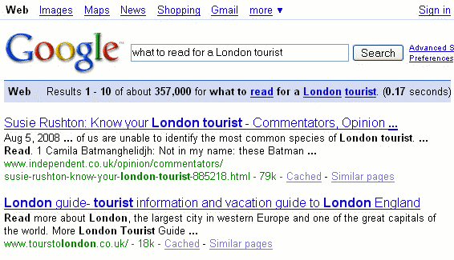
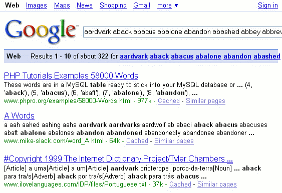

## 把你的查询翻译过来

了解谷歌如何处理您的搜索词将有助于您制定有效的查询并修改无效的查询。

### 1.所有搜索词计数

> 谷歌只返回与您所有搜索词匹配的页面。

搜索 [ [compact fold-up bicycle](https://www.google.com/search?q=compact+fold-up+bicycle) ] 会找到包含“紧凑”、“折叠”和“自行车”的页面。因为您不需要在术语之间包括单词AND，所以这种表示法称为隐式AND。

- [ [compact fold-up bicycle](https://www.google.com/search?q=compact+fold-up+bicycle) ]

由于隐式的AND，您可以通过添加更多术语来聚焦查询。

- [ [compact lightweight fold-up bicycle](https://www.google.com/search?q=compact+lightweight+fold-up+bicycle) ]

> 注意：如果您想要包含任何（而不是所有）搜索词的页面，请使用 OR 运算符。 
>
> 注意：有时 Google 会返回不包含查询词的页面，就像您在示例中看到的那样。Google 返回包含查询词的链接文本（解释为描述）指向另一页或页面上其他位置，更常被称为指向该页的链接的锚文本所在处。

### 2.搜索词完全匹配

> 谷歌会返回与您的搜索词完全匹配的页面。

在他的书《互联网研究》第二版（麦克法兰公司，2001年）中，内德·菲尔登指出：“谷歌只是简单地将字符串匹配在一起，并且目前不基于语言使用进行推理。虽然这种搜索方法有一些缺点，但它利用了计算机的一个神奇力量——快速准确地筛选大量数据。

| If you search for … | Google won't find … |
| ------------------- | ------------------- |
| cheap               | inexpensive         |
| tv                  | television          |
| effects             | influences          |
| children            | kids                |
| car                 | automobile          |
| Calif OR CA         | California          |

> 注意：当Google发现包含您搜索词的同义词的页面时，这些同义词会以粗体字显示在Google的片段中。

| If you search for … | Google finds …         |
| ------------------- | ---------------------- |
| NYC                 | New York City          |
| SF                  | San Francisco          |
| GNP                 | Gross National Product |

### 3.相似词匹配

> 相似词匹配

查询 [儿童自行车头盔] 可以找到包含与您的搜索词类似的单词的页面，例如“child”，“children”或“children's”，“bicycle”，“bicycles”，“bicycle's”， “Bicycling”或者是 “bicyclists”, 以及 "helmet" 或 "helmets". Google 称这个功能为单词变体或自动分词。分词是一种在可以有多个结尾的单词的基础上进行搜索的技术，它会查找该单词的干部或根部。

如果您只想搜索包含某些术语的页面，请将每个单词或短语用引号括起来（“”）。请参阅引用短语和引号替换+运算符。

当您的查询只包含一个术语时，Google不会匹配变体。

> 注意：当您需要Google无法找到的同义词或变体时，请考虑使用OR或波浪线运算符。

### 4.停用词

> 一些常见的词语，被称为“停用词”（例如the、on、where、how、de、la以及某些单个数字和字母），通常不会对搜索结果增加意义。

停用词出现在很多页面上，因此搜索它们通常无法帮助您找到相关的结果。

- [ [what to read for a London tourist](https://www.google.com/search?q=what+to+read+for+a+London+tourist) ]

 

因为您搜索的单词（除了停用词）必须出现在页面上，我们已经告诉谷歌只显示包含“read”一词的页面。（搜索可能会找到想要阅读有关游客信息的页面。）更好的搜索应该是所有您正在寻找的页面都应该出现的单词。例如，请尝试：

- [ [London tourist](https://www.google.com/search?q=London+tourist) ]

> 注意：将每个这样的单词或短语用引号括起来（“”）以强调要求 Google 搜索确切的这些单词。我们很快会在《打造您的查询》中介绍这些基本运算符和其他内容。

如果您的查询仅包含 Google 通常忽略的常见单词，Google 将搜索与所有术语匹配的页面。

- [ [the who](https://www.google.com/search?q=the+who) ]

> 注意：查找提到摇滚乐队The Who的更多页面，请输入[“the who”]，这是您很快将在引用短语页面中了解的一种标记符号。

### 5.字数限制

> 谷歌将查询限制在32个单词以内。

谷歌将在页面顶部的查询框下方显示一条消息，指示您的查询是否超过了32个单词的限制。 32个单词的限制适用于搜索术语和运算符，但不适用于停止词。（此前该限制为10个单词。）

以下查询可以找到在字典开头可能出现的32个单词的页面。

- [ [aardvark aback abacus abalone abandon abashed abbey abbreviate abdicate abdomen abduct aberration abhor abide ability abject able abnormal aboard abode abolish abolitionist abort about above abrade abridge abroad abrupt abscond absent absinthe](https://www.google.com/search?q=aardvark+aback+abacus+abalone+abandon+abashed+abbey+abbreviate+abdicate+abdomen+abduct+aberration+abhor+abide+ability+abject+able+abnormal+aboard+abode+abolish+abolitionist+abort+about+above+abrade+abridge+abroad+abrupt+abscond+absent+absinthe) ]

 

如果您再添加更多的单词，谷歌将会显示类似于以下警告信息：“absolve”（以及后续的单词）被忽略了，因为我们限制查询长度最多为32个单词。

### 6.附近关键词

> 谷歌更喜欢那些搜索结果中包含您的关键词且这些关键词彼此相近的内容。

谷歌考虑搜索词在页面中的接近程度。因此，查询[蛇草]会找到关于该植物的页面，而[草丛中的蛇]则更强调有关狡猾人物的页面。尽管谷歌忽略了“in”和“the”这些停用词，但它仍然会优先考虑将“蛇”和“草”分隔两个单词的页面。

- [ [snake grass](https://www.google.com/search?q=snake+grass) ]
- [ [snake in the grass](https://www.google.com/search?q=snake+in+the+grass) ]

### 7.关键词顺序

> 谷歌会优先显示那些页面，这些页面中的关键词顺序与您的查询相同。

因此，您应该按照您期望在寻找的页面上找到它们的顺序输入搜索词。搜索 [纽约图书馆] 会优先显示关于纽约图书馆的页面。而查询 [约克新图书馆] 则会优先显示有关约克新图书馆的页面。

- [ [New York library](https://www.google.com/search?q=New+York+library) ]
- [ [new library of York](https://www.google.com/search?q=new+library+of+York) ]

### 8.不区分大小写

> Google不区分大小写；它会显示大写和小写的结果。

忽略大小写会增加谷歌发现的结果数量。搜索  [ [Red Cross](https://www.google.com/search?q=Red+Cross) ] 会找到包含“Red Cross,” “red cross,” or “RED CROSS.”

[ [Red Cross](https://www.google.com/search?q=Red+Cross) ], [ [red cross](https://www.google.com/search?q=red+cross) ] 和 [ [RED CROSS](https://www.google.com/search?q=RED+CROSS) ] 返回相同的结果。 

没有办法指示谷歌注意大小写区分，例如，您不能告诉谷歌仅查找每个单词的第一个字母大写的“Red Cross”出现次数。 

> 注意：如果以大写输入，“OR”和“AND”这些单词具有特殊意义。

### 9.忽略的字符

> 谷歌忽略一些标点符号和特殊字符，包括**`! ? , . ; [ ] @ / # < > `.**

因为标点通常不像周围的文本那样重要，所以 Google 忽略搜索词中的大多数标点符号。但也有例外，例如 C++ 和 $99。Google 计算器不会忽略数学符号，如 /、< 和 >。 [Dr. Ruth] 与 [Dr Ruth] 返回相同的结果。 

如果您正在寻找包含 Google 忽略的标点符号（例如电子邮件地址）的信息，则只需输入整个内容，包括标点符号即可。

- [ [info@amazon.com](https://www.google.com/search?q=info@amazon.com) ]

请注意，有些网页会掩盖电子邮件地址，以使垃圾邮件发送者难以收集此类信息。例如，在某些网站上，您会发现电子邮件地址中的@符号被替换为单词“at”。

现在我们来看一些谷歌不会忽略的特殊字符。

### 10.撇号

> 带有撇号（单引号，'）的术语与不带撇号的术语不匹配。

使用“we're”一词的查询返回的结果与使用“were”一词的查询不同。

- [ [we're](https://www.google.com/search?q=we're) ] matches “we're” but not “were”
- [ [were](https://www.google.com/search?q=were) ] matches “were” but not “we're”

### 11.连字符术语

> 因为有些人在连字符词中使用连字符，而另一些人则使用空格，所以谷歌会搜索任何带连字符的术语的变体。

当Google在查询词中遇到连字符（-），例如[ [part-time](https://www.google.com/search?q=part-time) ]，它会搜索以下内容：

- the term with the hyphen, e.g., part-time
- the term without the hyphen, e.g., parttime
- the term with the hyphen replaced by a space, e.g., part time

- [ [part-time](https://www.google.com/search?q=part-time) ] matches “part-time,” “part time,” and “parttime”
- [ [part time](https://www.google.com/search?q=part+time) ] matches “part-time” and “part time”, but
- [ ["part time"](https://www.google.com/search?q="part+time") ] (with [quotes](https://www.googleguide.com/quoted_phrases.html#includeStopWords)) is better for space-separated words

Also:

- [ [e-mail](https://www.google.com/search?q=e-mail) ] matches “e-mail,” “email,” and “e mail”
- [ [email](https://www.google.com/search?q=email) ] matches “email”

> **Note:** Google may search for variations of your query terms that are included in the online dictionary that Google uses.

- [ [non profit](https://www.google.com/search?q=non+profit) ] matches “non-profit,” “nonprofit,” and “non profit”

如果您不确定一个单词是否需要用连字符，请尝试在搜索时加上连字符。

### 12.总结

以下表格总结了谷歌如何解释您的查询。

| Search Behaviors                 | Descriptions                                                 |
| -------------------------------- | ------------------------------------------------------------ |
| Implicit AND                     | Google returns pages that match *all* your search terms. Because you don't need to include the logical operator AND between your terms, this notation is called an implicit AND. |
| Exact Matching                   | Google returns pages that match your search terms exactly.   |
| Word VariationAutomatic Stemming | Google returns pages that match variants of your search terms. |
| Common-Word Exclusion            | Google ignores some common words called “stop words,” e.g., *the*, *on*, *where*, and *how*. Stop words tend to slow down searches without improving results. |
| 32-Word Limit                    | Google limits queries to 32 words.                           |
| Term Proximity                   | Google gives more priority to pages that have search terms near each other. |
| Term Order                       | Google gives more priority to pages that have search termsin the same order as the query. |
| Case Insensitivity               | Google is case-insensitive; it shows both upper- and lowercase results. |
| Ignoring Punctuation             | Google ignores most punctuation and special characters including `, . ; ? [ ] ( ) @ / * < >` |

接下来我们将看一下如何调整您的搜索查询。 

有关 Google 搜索基础知识的更多信息，请访问《[如何使用 Google 进行搜索](https://support.google.com/websearch/answer/134479)》。

### 练习

这些问题旨在帮助您了解Google如何解释您的搜索词。有关选定问题的提示和答案，请参阅“解决方案”页面。

- 指出哪些查询会匹配包含“GoogleGuide”的页面。

​		[ guide ]   [ goog ]   [ googleguide ]   [ GoogleGuide ]   [ google ]

- 在美国大城市，给予提供外卖服务的人小费的通常百分比是多少？也就是说，他们会把你点的食物打包并收取付款。
- 指出以下查询将找到哪些单词

| [ year-end ] | year-end | year end | yearend |
| ------------ | -------- | -------- | ------- |
| [ year end ] | year-end | year end | yearend |
| [ yearend ]  | year-end | year end | yearend |

- 你预测哪些查询最有可能找到打折的设计师亚麻布料网站？

| [ discounted designer linens ] |
| ------------------------------ |
| [ discount designer linen ]    |
| [ designer linen discount ]    |
| [ linen designer discount ]    |
| [ linen discounted design ]    |

- 通过以下查询，谷歌是否进行词干处理，即匹配搜索词的变体？

[ [color printer](https://www.google.com/search?q=color+printer) ]
[ [color printers](https://www.google.com/search?q=color+printers) ]
[ [color printer OR printers](https://www.google.com/search?q=color+printer+OR+printers) ]

- 为什么查询 [Be Manual] 没有包含任何关于 Be 操作系统的结果？

标签（关键词）：撇号，大小写敏感，连字符，顺序，查询，搜索术语，停用词，同义词。