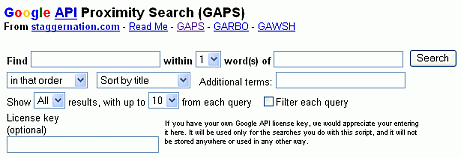

## *运算符

> 使用*，星号字符，也称为通配符，在短语中匹配一个或多个单词（用引号括起来）。

每个 * 代表一个或多个单词。Google 将 * 视为一个占位符，表示一个或多个单词。例如，[“Google * 我的生活”] 告诉 Google 查找包含以 “Google” 开头、后跟一个或多个单词、最后是 “我的生活” 的短语的页面。符合条件的短语包括：“Google 改变了我的生活”，“Google 控制着我的生活”和“Google 是我生命中的一部分”。

[ [“Google * my life“](https://www.google.com/search?q="Google+*+my+life") ]

如果您知道您要查找的页面上有一个日期，但不知道它的格式，请使用OR运算符指定几个常见格式。例如：

[ [California election “Oct * 2003“ OR “10/*/03“ OR “October * 2003“](https://www.google.com/search?q=california+election+"Oct+*+2003"+OR+"10/*/03"+OR+"October+*+2003") ]

When you know only part of the phrase you wish to find, consider using the * operator. Find the title of Sherry Russell’s book that can help you deal with the tragedies of 9/11 or losing a loved one.

[ [“Conquering the * and * of Grief“](https://www.google.com/search?q="Conquering+the+*+and+*+of+Grief") ]

当您想要查找包含某人姓名的页面时，接近搜索可能非常有用：名字中间名姓氏、姓氏名字中间名、名字姓氏、姓氏名字。要搜索“Francis”与“Coppola”相邻或相隔一个单词，则需要四个查询：

[ [“Francis Coppola“](https://www.google.com/search?q="Francis+Coppola") ]
[ [“Francis * Coppola“](https://www.google.com/search?q="Francis+*+Coppola") ]
[ [“Coppola Francis“](https://www.google.com/search?q="Coppola+Francis") ]
[ [“Coppola * Francis“](https://www.google.com/search?q="Coppola+*+Francis") ]

如果您想搜索两个术语之间不超过两个单词的情况，即接近搜索，则需要六个查询。如果您有兴趣运行接近搜索，请尝试使用GAPS，这是一个第三方搜索工具，可在https://www.staggernation.com/cgi-bin/gaps.cgi上获得。

 

注意：您可以通过在查询中用 * 替换每个停用词或常见词来避免 Google 对查询单词数的 32 个限制。通配符不计入其中。

USE [ [All grown-ups * once children–although few * them remember *](https://www.google.com/search?q="All+grown-ups+*+once+children--although+few+*+them+remember+*.") ]
NOT [ [All grown-ups were once children–although few of them remember it](https://www.google.com/search?q="All+grown-ups+were+once+children--although+few+of+them+remember+it.") ]

谷歌选择符号 * 来匹配一个或多个单词，因为在某些计算机系统（如Unix、Linux和DOS）中，* 代表一个或多个未指定的字符。在这些语言中，它通常用于选择多个文件和目录。

注意：词干提取是一种搜索单词的技术，它可以搜索具有多个结尾的单词的词干或根。例如，在某些搜索引擎上，查询bicycl*将返回与包括bicycle、bicycles、bicycling、bicycled和bicyclists等单词匹配的结果。Google忽略未被空格包围的星号（*）。查询[ bicycl* ]会找到包含“bicycl”的文档。Google自动提供了词干处理功能。

如果您想搜索带有星号或其他特殊字符的字符串，请尝试使用www.google.com/codesearch，谷歌的代码搜索引擎。