## 高级搜索表单

当你找不到你想要的东西时，考虑使用Google的高级搜索功能更精确地指定你想要的内容。不要被“高级搜索”这个名字吓到；它很容易使用，并且允许你比Google标准搜索框更精确地选择或排除页面。点击Google搜索框右侧的“高级搜索”链接即可。

 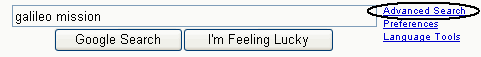

或者访问www.google.com/advanced_search并填写表格。（如果您之前从标准搜索框输入了查询，然后单击结果页面顶部的高级搜索链接，则高级搜索表单会自动填充来自先前查询的适当信息。）

高级搜索表单的顶部是您指定大多数搜索要求的地方。单击“日期、使用权、数字范围和更多”链接或其旁边的+号，即可显示更多选项（我们将在后面的章节中看到）。在搜索表单底部有一些链接，包括针对谷歌特定主题的搜索，其中包括各种计算机操作系统和大学等专门搜索。

 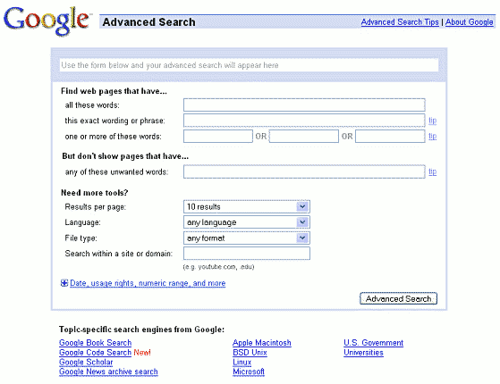

表单顶部的框中，最初包含灰色文本“使用下面的表单，您的高级搜索将出现在此处”，显示了由您的高级搜索生成的Google查询 - 包括特殊字符和高级运算符（如果有）。这是熟悉那些高级Google功能的好方法。

> 表单顶部的框中，最初包含灰色文本“使用下面的表单，您的高级搜索将出现在此处”，显示了由您的高级搜索生成的Google查询 - 包括特殊字符和高级运算符（如果有）。这是熟悉那些高级Google功能的好方法。

| Advanced Search field        | Basic Search Example                                         | Basic Search results                              |
| ---------------------------- | ------------------------------------------------------------ | ------------------------------------------------- |
| all these words              | [ [tap dance](https://www.google.com/search?q=tap+dance) ]   | with **all** search terms                         |
| this exact wording or phrase | [ [“tap dance“](https://www.google.com/search?q="tap+dance") ] | only with the exact phrase inside the quotes      |
| one or more of these words   | [ [tap OR ballet](https://www.google.com/search?q=tap+OR+ballet) ] | with **at least one** of the terms adjacent to OR |
| any of these unwanted words  | [ [tap –dance](https://www.google.com/search?q=tap+-dance) ] [ [–tap dance](https://www.google.com/search?q=-tap+dance) ] | including none of the terms preceded by a –       |

让我们看一些例子。如果您在本节中单击屏幕截图，将会跳转到运行相应搜索的结果页面。

- 要找到有关Google的教程介绍，请在顶部字段（所有这些单词）中指定[google]，并在第三行的三个字段中指定[教程][指南][介绍]（其中一个或多个单词）。

​	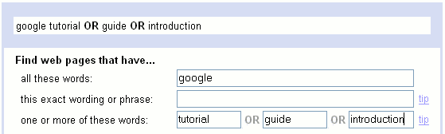

- 找出如何从Palm地址簿中导出地址以打印标签。

​	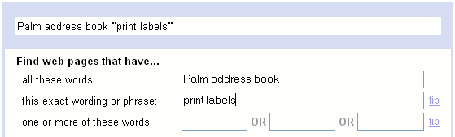

- 高级搜索页面的第二部分允许您省略包含特定单词的页面。

​    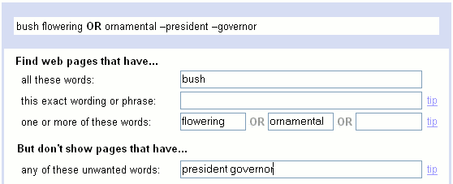

- 高级搜索页面的下一部分“需要更多工具？”可以更好地控制您搜索结果中列出的页面。

​	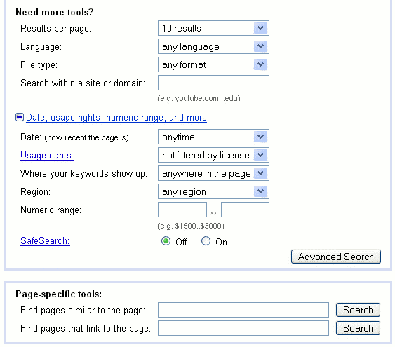

- 现在我们来看一下表格的其余部分，包括您单击“日期、使用权、数字范围和更多”或旁边的+后打开的部分。如果您想要跳转到特定部分，请从此列表中选择：
  - [Results per page](https://www.googleguide.com/sharpening_queries.html#numResults)
  - [Language](https://www.googleguide.com/sharpening_queries.html#language)
  - [File Format](https://www.googleguide.com/sharpening_queries.html#file)
  - [Domain](https://www.googleguide.com/sharpening_queries.html#domain)
  - [Date](https://www.googleguide.com/sharpening_queries.html#date)
  - [Usage Rights](https://www.googleguide.com/sharpening_queries.html#usage)
  - [Occurrences](https://www.googleguide.com/sharpening_queries.html#occurrences)
  - [Region](https://www.googleguide.com/sharpening_queries.html#region)
  - [Numeric Range](https://www.googleguide.com/sharpening_queries.html#numRange)
  - [SafeSearch](https://www.googleguide.com/sharpening_queries.html#safeSearch)
  - [Similar Pages](https://www.googleguide.com/sharpening_queries.html#pagesSimilar)
  - [Linking Pages](https://www.googleguide.com/sharpening_queries.html#pagesLink)

### 1. 每页结果

要一次查看超过十个搜索结果，请选择下拉式“每页显示结果数”框中的数量。结果页面加载时间会更长，但如果您使用的是较慢的互联网连接，则可能只会注意到差异。要查看每页50个结果：

 

（选择结果数量不会影响您在表单顶部的“高级搜索将出现在此处”框中看到的内容。但是，在执行搜索后，浏览器窗口顶部的URL应包括文本&num=50;它指定每页50个结果。）

### 2.语言

下拉式的“语言”框可以将结果限制为特定语言编写的页面。例如，查找在西班牙安达卢西亚地区酒店推荐的西班牙语页面。单击下面的图像执行搜索：

 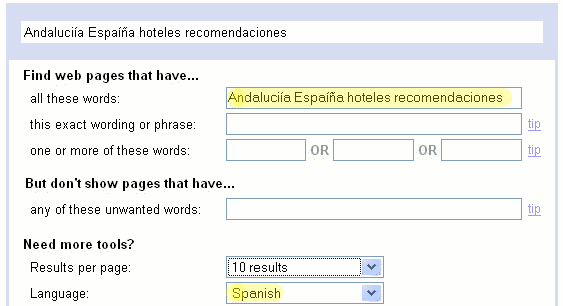

（选择语言不会改变表单顶部的框中显示的内容。但是，在执行搜索后，浏览器窗口顶部的URL应包含文本&lr=lang_es;它指定了西班牙语。）

如果您总是希望在特定语言或语言集中获得结果，则可以在Google偏好设置中更改搜索语言。请参阅自定义您的偏好设置，了解如何更改Google偏好设置以修改搜索结果的显示方式。

### 3.文件格式

在“文件格式”区域，您可以限制搜索结果为特定的文件格式或从结果中排除某种格式。可选项包括：

| File Format          | Suffix | Description                                                  |
| -------------------- | ------ | ------------------------------------------------------------ |
| Adobe Acrobat PDF    | .pdf   | A publishing format commonly used for product manuals and documents of all sorts. |
| Adobe PostScript     | .ps    | A printing format often used for academic papers.            |
| Microsoft Word       | .doc   | A common word processing format.                             |
| Microsoft Excel      | .xls   | A format for spreadsheets.                                   |
| Microsoft Powerpoint | .ppt   | A format for presentations and slides.                       |
| Rich Text Format     | .rtf   | A format used to exchange documents between Microsoft Word and other formats. |

由于PDF格式的文档往往比网页写得更好，因此让我们搜索PDF格式的房地产规划文件。点击下面的图像进行搜索：

 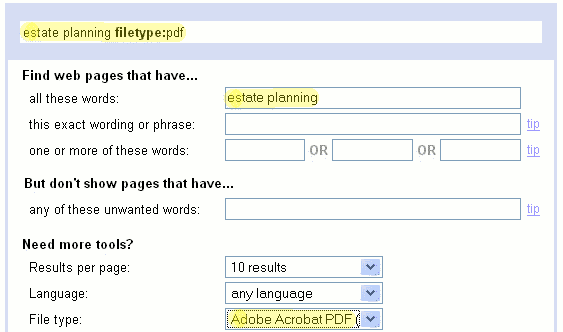

您可以使用filetype:搜索运算符将搜索限制为其他文件格式。

### 4.域名

要仅搜索特定网站（例如www.eff.org）或域名（例如.org），或完全从您的搜索中排除该网站或域名，请使用“在网站或域内搜索”字段。 在另一页中，我们将看到如何查找Web页面的网站或域，如果您知道其地址。

让我们看几个例子。如果您在本节中单击屏幕截图，将会带您到高级搜索表单，指定相应的搜索。

Larry Page and Sergey Brin是 Google 的创始人，当时他们还是斯坦福大学的研究生。他们写了一篇论文描述了他们的原型搜索引擎。让我们通过输入他们的名字并将搜索域限制为斯坦福大学的网站 stanford.edu 来搜索它。点击下面的图片进行搜索：

 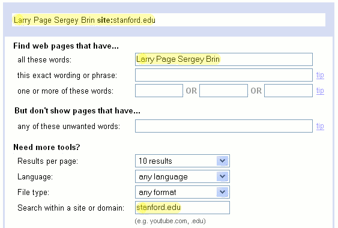

要查找有关为组织做志愿工作的信息，请搜索包含“volunteering”一词并限定域名为“.org”的结果。单击下面的图像执行搜索：

 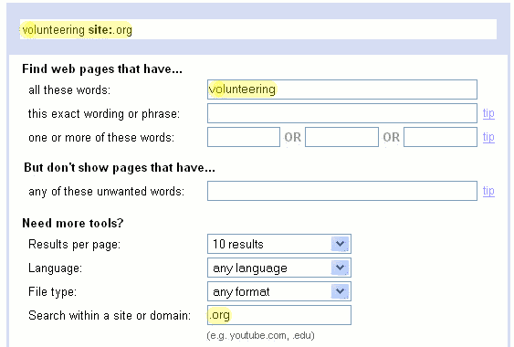

### 5.日期

在这里，您可以将结果限制为在过去三个、六个或十二个月内更新（创建或修改）、被爬取并添加到Google索引中的页面。经常更新的热门页面会被频繁地爬取和索引。

> 注意：页面上的任何更改都算作更新，即使只是拼写纠正。

当你需要查找及时信息，比如年度活动、新车或家电型号的规格，或者人们最近在做什么时，这个选项非常有用。

最近，科学家报告了有关荷尔蒙疗法风险和好处的新发现。这种疗法被40%的美国绝经后妇女用于缓解更年期症状。我们更可能通过仅搜索最近三个月内更新的网页来找到此信息的链接。点击下面的图像执行搜索：

 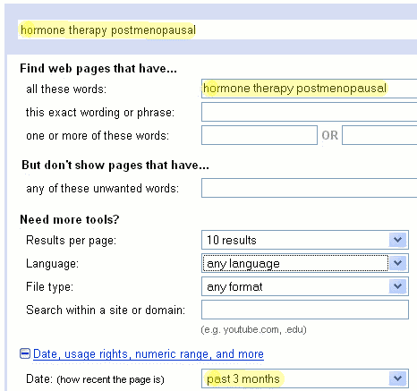

（选择日期范围不会影响您在表单顶部看到的“高级搜索将出现在此处”的框中看到的内容。但是，在执行搜索后，浏览器窗口顶部的URL应包括文本&as_qdr=m3；它指定了3个月。）

如果您想查看一个网站几个月或几年前的样子，或者该网站当前无法访问，请访问“回溯机器”（Wayback Machine）。“回溯机器”，也称为互联网档案馆，维护着许多互联网站点的快照数字图书馆。

### 6.使用权

对于受[创意共享许可证](https://creativecommons.org/)保护的页面，使用权允许您指定页面应允许哪些类型的使用。

一般来说，除非页面另有说明，否则可以安全地假定您在Google上找到的页面不能以任何您喜欢的方式自由使用。然而，一些页面具有特殊标记，告诉搜索引擎（如Google）该页面受Creative Commons许可证保护，并允许哪些类型的使用。 使用权利搜索会找到这些特别标记的页面。

你的选择是：

| Usage Rights                                    | Description                                                  |
| ----------------------------------------------- | ------------------------------------------------------------ |
| not filtered by license                         | standard, unfiltered Google results                          |
| free to use or share                            | results you can copy or redistribute                         |
| free to use or share, even commercially         | results you can copy or redistribute for profit              |
| free to use share or modify                     | results you can copy or adapt, as well as redistribute       |
| free to use, share or modify, even commercially | results you can copy or adapt, as well as redistribute, for profit |

请注意，仅通过使用权搜索找到页面并不能保证您的权利。您应该检查每个页面以确保其使用条款。

假设你想建立一个蔬菜食谱网站。我们可以在Google上找到使用权为“免费使用、共享或修改，甚至商业用途”的页面。

 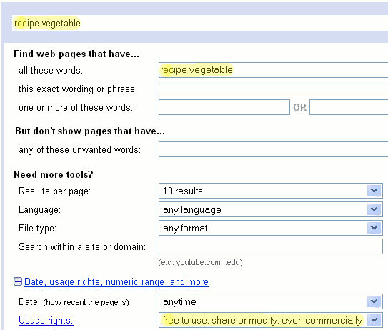

指定使用权限不会改变表单顶部的内容。设置此下拉框将更改您浏览器的URL，可能会很复杂。如果您好奇，请尝试各种设置并检查在单击“高级搜索”按钮后获得的URL。

### 7.事件

标记为“您的关键词出现位置”的字段：允许您指定搜索术语必须在页面上出现的位置。选择包括页面任何位置、标题中、文本中、URL 中或链接到该页面的位置。

网页的标题通常显示在浏览器窗口的顶部和Google搜索结果页面的第一行。网站作者使用HTML <TITLE>元素指定页面的标题。一个网页只有一个标题。

统一资源定位符，更常被称为URL，是指定互联网上文件位置的地址。

链接是页面上与另一个网页或当前页面的不同位置相连的文本。当您单击链接时，将会跳转到它所连接的页面或位置。

在Google上查找URL包含FAQ的页面，其中FAQ是“常见问题”或“经常回答的问题”的缩写。在下面的解决方案中，我会寻找URL中同时包含Google和FAQ的页面。单击下面的图像执行搜索：

 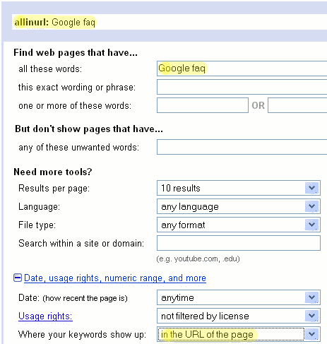

### 8.地域

在这里，您可以请求来自特定国家或地区的页面。（结果可能显示来自该地区的URL，也可能以更常见的域名结尾，如“.com”。在后一种情况下，该页面可能来自跨国网站的区域版本。）

要阅读有关克林顿总统或克林顿参议员的南非页面，请单击图像执行搜索：

 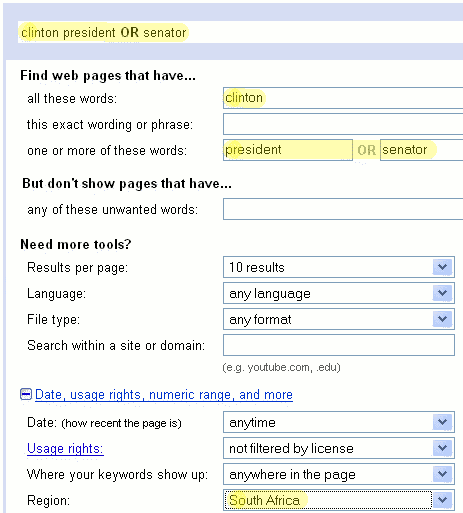

（选择地区不会改变表单顶部显示的搜索内容。但是，在您进行搜索之后，浏览器窗口顶部的URL应包含文本&cr=countryZA; ZA是南非的代码 - 以及其互联网域名。）

### 9.数字范围

使用数字范围：当您想要包含指定范围内数字的页面时。

当我对一款适合我的双胞胎婴儿的“半自行车”拖车感兴趣时，我搜索了一个名为Trail-a-Bike、价格在50美元至1000美元之间的产品。请点击下面的图片进行搜索：

 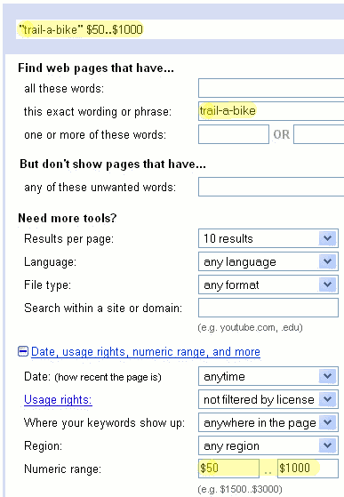

（在这种情况下，我也可以使用谷歌的产品搜索。）

### 10.安全搜索

SafeSearch：区域允许您过滤掉包含色情或露骨性内容的网站，并将它们从搜索结果中排除。请注意，谷歌的自动过滤并不能保证您不会看到令人反感的内容。

当您关闭SafeSearch过滤并搜索非色情内容时，谷歌会按照一种方式对结果进行排序，以使成人网站不会被列为突出显示的选项。例如，在关闭SafeSearch的情况下搜索[乳腺癌治疗]，您不太可能遇到具有挑逗性乳房图像的网站。

 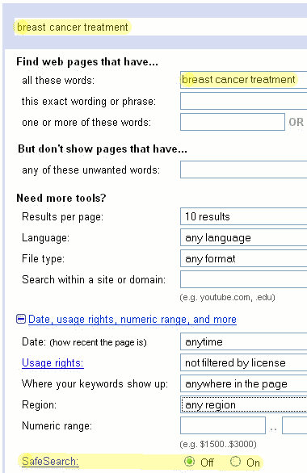

为了尽可能返回更多有用的结果，SafeSearch 目前不会过滤仇恨言论、无政府主义、犯罪活动、粗俗和低级趣味的内容、非法武器制造等其他过滤系统试图排除的内容。

### 11.特定页面搜索

> 页面特定工具：”搜索框不再是高级搜索表单的一部分。 请使用下面列出的搜索运算符 — related: 和 link:。

高级搜索表单还提供了页面特定的搜索功能，以查找与具有网址（URL）的页面相似的页面，并查找链接到特定页面的页面。

- 高级搜索表单还提供了页面特定的搜索功能，以查找与具有网址（URL）的页面相似的页面，并查找链接到特定页面的页面。

 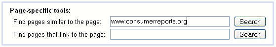

- （页面特定搜索与高级搜索表单的其余部分是分开的，因此它们不会更改表单顶部带有灰色文本“在下面使用您的高级搜索” 的框。但是，在您进行搜索之后，位于结果页面顶部附近的Google搜索框应该以相关操作符related: 开头 - 在这个例子中，related:www.consumerreports.org。）
- 网页之间相互链接。链接是单向的；您可以从一个页面跟随链接到另一个页面。您不能反过来遍历该链接，即无法从某个页面转到指向它的页面。然而，谷歌会记录这些信息并提供给用户使用。当您想知道谁链接了您的网站或其他人的网站时，请在特定于该页面的搜索部分中填写网址（URL），查找连接到该页面的网页：让我们找出谁链接了无国界医生组织（Doctors without Borders）也称为“无国界医生”（Médecins Sans Frontières (MSF)） 的 www.doctorswithoutborders.org 网站。

 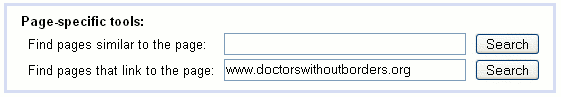

（关于相似页面搜索，您在高级搜索页面顶部的框中看不到链接搜索词。但是，在结果页面顶部附近的Google搜索框应该以搜索运算符link:开头——例如，link:www.doctorswithoutborders.org）

最常使用反向链接的用户是好奇自己网站被哪些网站链接的网络管理员和网站发布者。人们还会用它来查找谁链接到竞争对手的网站。

与高级搜索表单中的其他字段不同，页面特定搜索无法与其他查询术语组合。因此，每个都有自己的搜索按钮。

您可以轻松地从 Google 工具栏运行这些特定于页面的搜索。

您可以在搜索框中输入网站地址，而不是前往高级搜索表单，Google会返回该网站的链接以及其他相关链接：

- 谷歌网站的缓存 
- 与该网站相似的网页 
- 链接到该网站的网页 
- 谷歌已经爬取并按PageRank排序列出的所有来自该网站的页面 
- 包含URL的网页

例如，要了解精彩的参考网站www.refdesk.com，请在Google的搜索框中输入www.refdesk.com。

 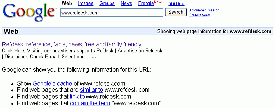

标签（关键词）：高级搜索，知识共享许可证，日期，域名，文件格式，语言，缩小搜索范围，数字、短语、查询、安全搜索、搜索术语和URL。