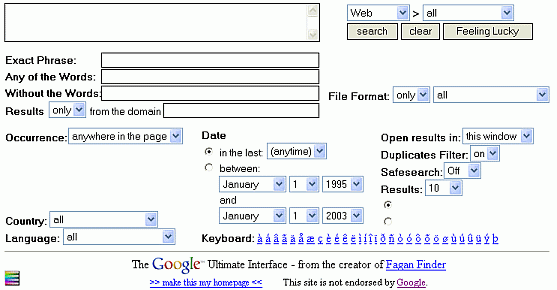
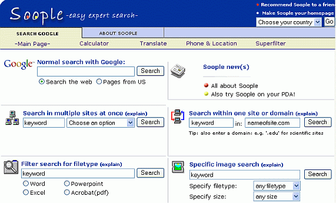

## 其他搜索表单

### 11. 警报

一旦您完善了高级搜索，就可以通过设置Google提醒来观察前20个结果的变化。 Google会每周、每天或在找到新网页时立即查找并提供链接。只需将高级搜索查询复制并粘贴到Google提醒页面上的搜索框中即可。

### 12.Google 终极界面

> 谷歌终极界面已更新。

如果您想比 Google 的高级搜索表单提供更精确的搜索条件，请尝试使用 Google Ultimate Interface，这是一个第三方应用程序，可在 www.faganfinder.com/google.html 上获得。通过 Ultimate Interface，您可以：

- 使用谷歌的任何搜索引擎进行搜索，例如Web Search或部分命名为Services的工具。 

- 查找在任意两个特定日期之间更新过的页面 

- 从页面底部附近的键盘上选择带有几乎所有不同变音符号（如umlauts或重音符号）的字母。

 

迈克尔·法甘在青少年时期开发了Google Ultimate Interface。

### 13.Soople

> 截至2022年，Soople已经不存在了，该网站可能存在危险。

如果您不确定在Google上可以搜索哪些类型的信息，请查看Soople，网址为www.soople.com/soople_int.php。

 

我在《部件理解结果和搜索工具》中描述了 Soople 中包含的许多功能。

标签（关键词）：高级搜索，缩小搜索范围，查询，Soople，终极界面。