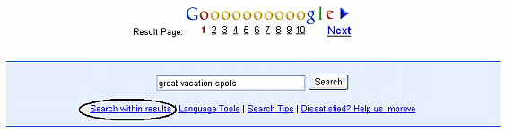

## 优化查询

优化查询意味着更改或添加搜索词组，以更好地返回您正在寻找的页面。成功的研究人员经常输入多个查询来查找他们所需的内容。

结果页面顶部和底部的搜索框显示当前结果页面的查询。如果查询使用了您直接或间接通过高级搜索表单输入的特殊运算符，则它们也会出现在搜索框中。要完善您的查询，请编辑搜索框中的内容，然后单击Google 搜索按钮或按ENTER键。

让我们看几个例子。

- 通过查看您的搜索结果，包括 Google 返回的片段和它们来自哪些页面，获取下一步搜索的想法。

  - 你应该在这个冬天接种流感疫苗吗？
    - TRY [ [flu shot](https://www.google.com/search?q=flu+shot) ]
  - 许多结果都涉及流感疫苗。
    - REFINE [ [flu OR influenza shot OR vaccine](https://www.google.com/search?q=flu+OR+influenza+shot+OR+vaccine) ]

- 利用成功的查询：深入了解您的结果。

  滚动到结果页面底部的搜索框，并单击“在结果内搜索”链接。这会导致Google使用您新指定的术语（即搜索框中的术语）仅在其从初始查询中找到的页面上运行新搜索，而不是在整个网络上进行搜索。

   

您可以通过在之前的查询中指定附加条件，少一步获得相同的结果。

在Internet Explorer和其他一些浏览器上，您可以轻松更改术语或整个查询。首先，通过双击单词或三次点击以突出显示整个查询来突出显示要更改的部分。然后，按DELETE键删除突出显示的文本，或键入新文本以替换它。

例如，要将“great vacation spots”更改为“great vacation areas”，请双击下面的单词“spots”，然后键入“areas”。

不要只用一个查询来搜索相关主题，而是将查询分成几个部分。在寻找工作时，通过搜索每个方面的技巧，你会比仅仅搜索描述所有求职方面的网站更容易找到更多的网站。

以下表格提供了缩小或聚焦搜索的建议，以及扩大产生少量有用结果的搜索的提示。单击表格中的链接，即可进入 Google 指南中描述功能和改进查询方式的部分。

| Too many results? Focus the search by…                       | Too few results? Broaden the search by…                      |
| ------------------------------------------------------------ | ------------------------------------------------------------ |
| adding a word or phrase                                      | removing a word or phrase                                    |
| specifying the order in which you want words to appear       | specifying words instead of phrases                          |
| using a more specific term                                   | using more general terms                                     |
| identifying ineffective terms and [removing them](https://www.googleguide.com/sharpening_queries.html#exclude) | [including synonyms or variant word forms](https://www.googleguide.com/synonym_operator.html) or using a more common version of the word’s spelling |
| [limiting to a domain or site](https://www.googleguide.com/sharpening_queries.html#domain) | [broadening the domain](https://www.googleguide.com/sharpening_queries.html#domain) or searching the entire web |
| [limiting to a date range](https://www.googleguide.com/sharpening_queries.html#date) | [removing a date range](https://www.googleguide.com/sharpening_queries.html#date) |
| [limiting where terms occur](https://www.googleguide.com/sharpening_queries.html#occurrences) | removing redundant terms or [splitting a multi-part query](https://www.googleguide.com/refining_query.html#split) |
| [restricting type of file](https://www.googleguide.com/sharpening_queries.html#file) | [searching any type of file](https://www.googleguide.com/sharpening_queries.html#file) |
| [limiting pages to a particular language](https://www.googleguide.com/sharpening_queries.html#language) | [translating your search terms into other languages](https://www.googleguide.com/translation.html#languageTools) and searching for the translated terms |
| [limiting pages to a particular country](https://www.googleguide.com/translation.html#languageTools) | searching the entire web                                     |

### 练习

这个问题集旨在通过使用高级搜索表单更精确地指定您所寻找的内容来帮助您练习。有关选定问题的提示和答案，请参见解决方案页面。

- 有哪些家庭疗法可以除掉蚂蚁？
- 查找有关猫去爪的事实。
- 谷歌的隐私政策是什么？我如何阻止之前的搜索记录在我输入新的搜索词时出现？
- 一些电影明星参加肉毒杆菌聚会。这样的聚会上发生了什么，他们为什么要参加？哪些明星使用了肉毒杆菌？
- 尼娜·托滕伯格是美国国家公共广播电台（NPR）的法律事务记者，她什么时候出生？她在哪里接受教育？她拥有什么学位？她是否上过法学院？
- 当您在谷歌搜索URL（例如www.guardian.co.uk）时，哪些链接会包含在您的结果中？
- 当您单击“查找包含术语“www.guardian.co.uk”的网页”链接时，搜索框中会显示什么？
- 哪个国家的域名代码是.at？
- 哪个国家的域名代码是.bm？
- 在Soople上运行几个查询。
- 使用Google Blaster同时运行多个查询。

标签（关键词）：扩大搜索，缩小搜索，查询，搜索框

