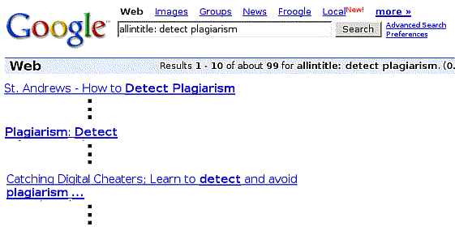

## 使用搜索运算符

您可以在普通搜索框查询中使用我们讨论过的大多数 Google 高级搜索表单选项。如果您是经常搜索或“高级搜索者”，这样做可以节省时间，因为您不需要打开高级搜索页面并填写各种框；相反，您几乎可以在任何 Google 搜索框中输入精细的查询。您将使用高级运算符，即对 Google 具有特殊含义的查询词。由于高级运算符方便进行搜索，Google Guide 将它们称为搜索运算符。

> 注意：我们建议您跳到“理解结果”部分，除非您是有经验的 Google 用户或想了解如何使用 Google 的高级运算符。

### 例子

以下是三个可以找到搜索运算符示例的地方。

- 访问Google指南高级运算符快速参考，查找形式为operator:value的特殊运算符。
- 填写谷歌的高级搜索表单。然后查看结果页面上的搜索框；您可能会发现谷歌已经向您的查询添加了搜索运算符。例如，如果您在高级搜索页面中填写，要求谷歌“查找所有单词”[检测抄袭]并“返回我的术语出现在：页面标题中”的结果，则您的结果页面应该像这里显示的那样。请注意，在您的查询之前，Google添加了allintitle: 搜索运算符：

​	

- 阅读下面的描述并尝试示例。

### 哪些作品适用于哪里？

以下表格列出了高级搜索页面上可通过搜索运算符访问的功能。单击表格中的运算符即可跳转到其描述（在另一页中描述所有搜索运算符）。

| Advanced Search Features             | Search Operators                                             |
| ------------------------------------ | ------------------------------------------------------------ |
| File Format                          | [`filetype:`](https://www.googleguide.com/advanced_operators_reference.html#filetype) |
| Occurrences in the title of the page | [`allintitle:`](https://www.googleguide.com/advanced_operators_reference.html#allintitle) |
| Occurrences in the text of the page  | [`allintext:`](https://www.googleguide.com/advanced_operators_reference.html#allintext) |
| Occurrences in the URL of the page   | [`allinurl:`](https://www.googleguide.com/advanced_operators_reference.html#allinurl) |
| Occurrences in the links to the page | [`allinanchor:`](https://www.googleguide.com/advanced_operators_reference.html#allinanchor) |
| Domain                               | [`site:`](https://www.googleguide.com/advanced_operators_reference.html#site) |
| Similar                              | [`related:`](https://www.googleguide.com/advanced_operators_reference.html#related) |
| Links                                | [`link:`](https://www.googleguide.com/advanced_operators_reference.html#link) |

以下表格列出了适用于每个 Google 搜索服务的搜索运算符。要阅读所有运算符的信息，请参见搜索运算符字母顺序列表，或单击表格中的某个运算符以跳转到其在字母顺序列表页面上的描述。

| Search Service | Search Operators                                             |
| -------------- | ------------------------------------------------------------ |
| Web Search     | [`allinanchor:`](https://www.googleguide.com/advanced_operators_reference.html#allinanchor), [`allintext:`](https://www.googleguide.com/advanced_operators_reference.html#allintext), [`allintitle:`](https://www.googleguide.com/advanced_operators_reference.html#allintitle), [`allinurl:`](https://www.googleguide.com/advanced_operators_reference.html#allinurl), [`cache:`](https://www.googleguide.com/advanced_operators_reference.html#cache), [`define:`](https://www.googleguide.com/advanced_operators_reference.html#define), [`filetype:`](https://www.googleguide.com/advanced_operators_reference.html#filetype), [`id:`](https://www.googleguide.com/advanced_operators_reference.html#id), [`inanchor:`](https://www.googleguide.com/advanced_operators_reference.html#inanchor), [`info:`](https://www.googleguide.com/advanced_operators_reference.html#info), [`intext:`](https://www.googleguide.com/advanced_operators_reference.html#intext), [`intitle:`](https://www.googleguide.com/advanced_operators_reference.html#intitle), [`inurl:`](https://www.googleguide.com/advanced_operators_reference.html#inurl), [`phonebook:`](https://www.googleguide.com/advanced_operators_reference.html#phonebook), [`related:`](https://www.googleguide.com/advanced_operators_reference.html#related), [`site:`](https://www.googleguide.com/advanced_operators_reference.html#site) |
| Image Search   | [`allintitle:`](https://www.googleguide.com/advanced_operators_reference.html#allintitle), [`allinurl:`](https://www.googleguide.com/advanced_operators_reference.html#allinurl), [`filetype:`](https://www.googleguide.com/advanced_operators_reference.html#filetype), [`inurl:`](https://www.googleguide.com/advanced_operators_reference.html#inurl), [`intitle:`](https://www.googleguide.com/advanced_operators_reference.html#intitle), [`site:`](https://www.googleguide.com/advanced_operators_reference.html#site) |
| Groups         | [`allintext:`](https://www.googleguide.com/advanced_operators_reference.html#allintext), [`allintitle:`](https://www.googleguide.com/advanced_operators_reference.html#allintitle), [`author:`](https://www.googleguide.com/advanced_operators_reference.html#author), [`group:`](https://www.googleguide.com/advanced_operators_reference.html#group), [`insubject:`](https://www.googleguide.com/advanced_operators_reference.html#insubject), [`intext:`](https://www.googleguide.com/advanced_operators_reference.html#intext), [`intitle:`](https://www.googleguide.com/advanced_operators_reference.html#intitle) |
| Directory      | [`allintext:`](https://www.googleguide.com/advanced_operators_reference.html#allintext), [`allintitle:`](https://www.googleguide.com/advanced_operators_reference.html#allintitle), [`allinurl:`](https://www.googleguide.com/advanced_operators_reference.html#allinurl), [`ext:`](https://www.googleguide.com/advanced_operators_reference.html#ext), [`filetype:`](https://www.googleguide.com/advanced_operators_reference.html#filetype), [`intext:`](https://www.googleguide.com/advanced_operators_reference.html#intext), [`intitle:`](https://www.googleguide.com/advanced_operators_reference.html#intitle), [`inurl:`](https://www.googleguide.com/advanced_operators_reference.html#inurl) |
| News           | [`allintext:`](https://www.googleguide.com/advanced_operators_reference.html#allintext), [`allintitle:`](https://www.googleguide.com/advanced_operators_reference.html#allintitle), [`allinurl:`](https://www.googleguide.com/advanced_operators_reference.html#allinurl), [`intext:`](https://www.googleguide.com/advanced_operators_reference.html#intext), [`intitle:`](https://www.googleguide.com/advanced_operators_reference.html#intitle), [`inurl:`](https://www.googleguide.com/advanced_operators_reference.html#inurl), [`location:`](https://www.googleguide.com/advanced_operators_reference.html#location), [`source:`](https://www.googleguide.com/advanced_operators_reference.html#source) |
| Product Search | [`allintext:`](https://www.googleguide.com/advanced_operators_reference.html#allintext), [`allintitle:`](https://www.googleguide.com/advanced_operators_reference.html#allintitle) |
| Product Search | [`allintext:`](https://www.googleguide.com/advanced_operators_reference.html), [`allintitle:`](https://www.googleguide.com/advanced_operators_reference.html) |

### 使用多个搜索运算符

您可以将许多基本运算符和搜索运算符结合使用。但是，有些必须单独使用，而其他一些则需要小心地搭配使用。

- 无法组合使用的搜索运算符

  - 大约有十几个搜索运算符不能与其他任何运算符组合使用。如果您这样做，Google可能不会返回任何匹配的文档。不应混合使用的搜索运算符包括：
    - 所有以“allin”开头的搜索运算符，例如 allinanchor:、allintext:、allintitle: 和 allinurl: 
    - 请求特殊信息的语法，例如 define: 或 phonebook。 
    - 页面特定的搜索运算符，例如 cache:、info: 和 related:。

- 谨慎地组合搜索运算符

  - 在查询中使用多个搜索运算符时，请注意其影响。以下是一些需要遵循的规则：

    - 不要使用会相互抵消的搜索运算符。例如，[ admission site:stanford.edu -inurl:stanford ] 搜索在 stanford.edu 网站上不包含字符串“stanford”的页面或网址。没有任何一个 URL 可以同时匹配这两个运算符。
    - 使用某些搜索运算符在查询中多次使用时，要注意不要排除所有结果。例如，[ sleep recommendations site:edu site:cdc.gov ] 不会返回任何睡眠建议，因为该查询同时寻找出现在.edu域和cdc.gov网站上的结果。如果您想从两个网站获得结果，请在两个site：规范之间包括OR，即 [ sleep recommendations site:edu OR site:cdc.gov ] 。应该仅在查询中使用一次或与OR组合使用的搜索运算符包括filetype：、site：和group：等。
    - 通过使用多个搜索运算符来聚焦您的搜索。例如，[intext：电子邮件 intitle：安全 -site：microsoft.com] 可以找到标题包含“安全”一词，并且页面文本中包含“电子邮件”但不在 microsoft.com 网站上的页面。

    注意：谷歌可能会更改未记录的运算符的工作方式或完全消除它们。

标签（关键词）：高级搜索，运算符，查询，搜索运算符

