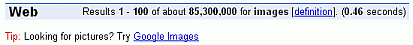
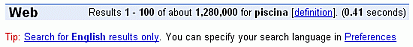
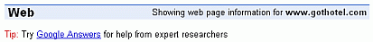
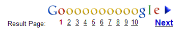

## 结果页面

结果页面充满了信息和链接，其中大部分与您的查询相关。

 

- Google标志：点击Google标志以进入Google主页。 
- 统计栏：描述您的搜索，包括当前结果页面上的结果数量和总结果数的估计，以及搜索所需时间。为了效率考虑，谷歌会估算结果数量；精确计算需要更长时间。这个估计是不可靠的。 
- 统计栏中每个下划线词都链接到其字典定义。只有一个定义链接到查询后面的查询被连接到一个定义。 
- 提示：有时候谷歌会在统计栏下方显示提示框。

 

 

 

- 搜索结果：按照与您的查询相关性排序，Google认为最相关的结果排在第一位。因此，通过按照它们出现的顺序查看结果，您很可能快速找到所需内容。 Google通过考虑100多个因素来评估相关性，包括有多少其他页面链接到该页面、搜索词在页面中的位置以及搜索词之间的接近程度等。以下是一些搜索结果组件的描述。这些组件在结果页面上以不同颜色的字体出现，以便更容易地区分它们。

  - 页面标题：（蓝色）网页的标题，如果有的话，或者它的URL，如果页面没有标题或Google没有索引所有页面内容。单击页面标题（例如，“胸罩的历史-玛丽·菲尔普斯·雅各布”）以显示相应的页面。

  - 片段：（黑色）每个搜索结果通常包括一个或多个短的文本摘录，这些摘录与您的查询和搜索词以粗体字匹配。每个不同的摘录或片段之间用省略号（…）分隔。这些片段以黑色字体显示，可能为您提供： 

    - 您正在寻找的信息 
    - 链接页面上可能找到的内容 
    - 在后续搜索中使用的术语思路

    当Google没有爬取页面时，它不会包含摘录。页面可能没有被爬取是因为其发布者请求不进行爬取，或者该页面编写方式过于复杂而无法进行爬取。

  - 结果的URL：（绿色）搜索结果的网址。在屏幕截图中，第一个结果的URL。如，https://www.thoughtco.com/inventions-4133303

  - 大小：（绿色）网页文本部分的大小。对于尚未索引的站点，此项被省略。在屏幕截图中，“5k”表示网页文本部分为5千字节。一千字节是1024（2^10）个字节。一个字节通常可以容纳一个字符。一般来说，单词的平均长度为六个字符。因此每1k文字大约有170个单词。包含5K字符的页面大约有850个单词长.

    大型网页比较小的页面更不可能与您的查询相关。为了提高效率，Google 只搜索网页的前 101 千字节（大约 17,000 字）和 PDF 文件的前 120 千字节。假设每行有 15 个单词，每页有 50 行，则 Google 搜索网页的前22页和 PDF 文件的前26页。如果一个页面更大，Google 将把该页面列为101千字节或PDF文件为120千字节。这意味着 Google 的结果不会引用超出其第一个101千字节或PDF文件第一个120千字节以外任何部分的网页。

  - 日期：（绿色）有时候，谷歌爬取网页的日期会出现在页面大小之后。这个日期告诉你谷歌所拥有的该页面副本的新鲜程度。只有最近进行了更新抓取的页面才会包含日期信息。

  - 缩进结果：当谷歌从同一网站找到多个结果时，它会将最相关的结果列在第一位，并将来自该网站的第二个最相关页面缩进显示。在屏幕截图中，缩进的结果和上面的一个都来自https://inventors.about.com这个网站。

    将来自同一网站的搜索结果限制为两个，可以确保该网站的页面不会主导您的搜索结果，并且Google会提供来自多个网站的页面。

  - 更多结果：当同一网站有两个以上的结果时，请通过“更多来自...”链接访问其余结果。

    当谷歌返回超过一页的结果时，您可以通过单击页面数字或出现在页面上最后一个搜索结果下方的“Gooooogle”中的任何一个“o”来查看后续页面。

     

  

  ​		如果你发现自己在浏览一页又一页的搜索结果，可以考虑通过更改全局偏好设置来增加谷歌每个结果页面显示的结果数量。 然而，在实践中，如果你感兴 趣的页面不在前10个结果内，建议优化查询而不是筛选无关的搜索结果。为了简化这样的优化过程，谷歌在页面底部包含一个搜索框供您输入精细调整后的查询。

  - 赞助链接：您的搜索结果可能包括一些明确标识为赞助链接（广告）与您的搜索相关。如果任何一个您搜索的关键词出现在广告中，谷歌会以粗体显示它们。
  - 拼写更正、词典定义、缓存、相似页面、新闻、产品信息、翻译和书籍结果：您的搜索结果可能包括这些链接，它们将在接下来的几章中进行描述。

  

  这是另一张结果页面的截图，以防顶部的那个滚动到了您的屏幕之外。

   

  

标签（关键词）：结果，片段，URL。